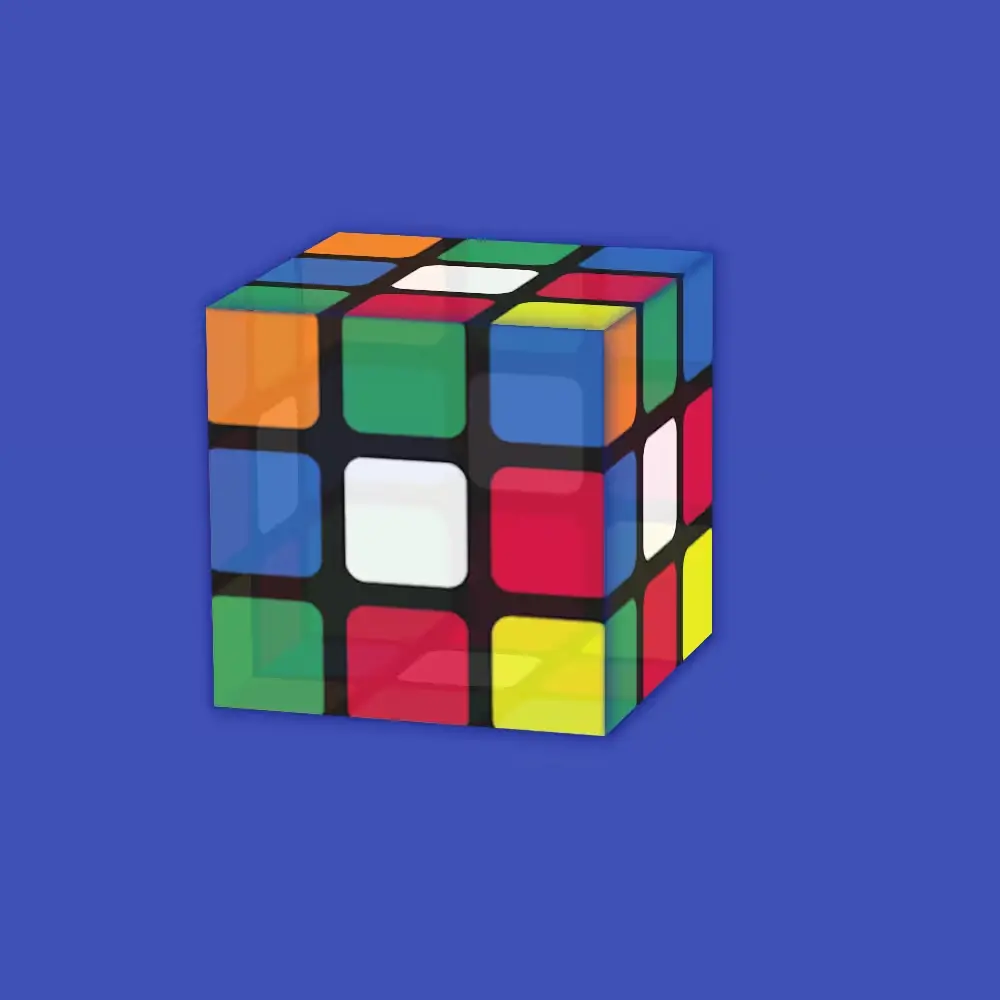

# 🧊 Cube 3D Animé en CSS

Une démonstration simple et élégante d’un cube 3D animé en **CSS pur**, sans JavaScript. Le cube tourne automatiquement sur les axes X et Y, et se décompose subtilement au survol de la souris pour un effet visuel interactif.

---

## ✨ Fonctionnalités

- 🌐 100% CSS (aucune ligne de JavaScript)
- 🎞️ Animation fluide en boucle
- 💎 Effet d'ouverture des faces au survol (`hover`)
- 🧱 Cube composé de 6 faces personnalisables (images ou couleurs)
- 📦 Facilement intégrable à n’importe quel site

---

## 🧰 Technologies utilisées

- **HTML5**
- **CSS3**
  - Transforms 3D
  - Keyframes
  - Transitions

---

## 🚀 Utilisation

1. Clone ou télécharge ce dépôt.
2. Ouvre `index.html` dans un navigateur moderne (Chrome, Safari).
3. Admire le résultat !

---

## 📌 Compatibilité

Ce projet utilise les préfixes `-webkit-` pour garantir la compatibilité avec les navigateurs basés sur WebKit (Chrome, Safari, Edge Chromium, etc.). Pour une compatibilité étendue, tu peux ajouter les préfixes supplémentaires comme `-moz-` ou `-ms-`.

---

## 📄 Licence

Ce projet est distribué sous la licence **MIT**. Tu peux l’utiliser, le modifier et le partager librement.

---

## 🙌 Remerciements

Inspiré par les possibilités incroyables des **transforms CSS3** et de la **créativité web**.

---

> N'hésite pas à créer une _pull request_ ou ouvrir une _issue_ si tu veux contribuer ou poser une question !
